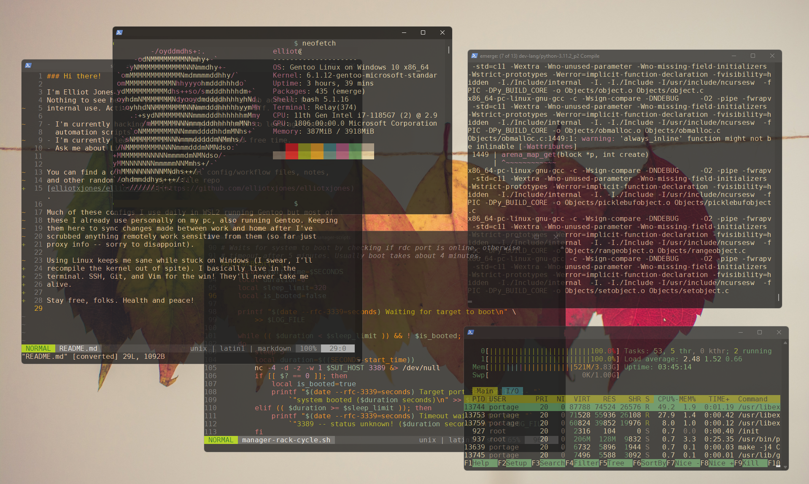

### Hi there!

I'm Elliot Jones.  
Nothing to see here -- just my Intel company Github account for  
internal use. Active so long as I don't get laid off.  
  
- I'm currently hacking on internal python tools to leverage custom  
  automation scripts.
- I'm currently learning C in my (very) limited free time.
- Ask me about Linux!
  
  
You can find a collection of personal config/workflow files, notes,  
and other random stuff on my profile repo  
[elliotxjones/elliotxjones](https://github.com/elliotxjones/elliotxjones).  
  
Much of these configs I use daily in WSL2 running Gentoo but most of  
these I already use personally on my pc, also running Gentoo. Keeping  
them here to sync changes made between work and home after I've  
scrubbed anything remotely work sensitive from them (so far just  
proxy info -- sorry to disappoint).  
  
Using Linux keeps me sane while stuck on Windows (I swear, I'll  
recompile the kernel out of spite). I basically live in the  
terminal. SSH, Git, and Vim for the win! They'll never take me  
alive.  
  

  
Stay free, folks. Health and peace!

